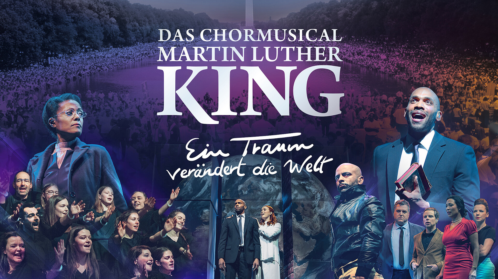

### [Das Chormusical Martin Luther King](https://www.king-musical.de?target=_blank) 
Ein Projekt der Stiftung Creative Kirche

&nbsp;

Aufführung in Berlin: am 22. März 2025 in Berlin in der Uber Arena.

Zum Mitsingen im Projektchor, dem Herzstück der Inszenierung, ist jeder eingeladen –  generations- und konfessionsübergreifend.

Eckdaten:
* 05.09.2024 18:00-20:00 Informationsveranstaltung  (St. Marienkirche, Berlin)
* 05.10.2024 11:00-17:00 Erste Gemeinsame Probe des Projektchores (St. Marienkirche, Berlin)
* individuelle Proben (einzeln oder in Chören)
* 08.03.2025 11:00-17:00 Hauptprobe (St. Marienkirche, Berlin)
* Generalprobe am 22.03.2025 ab 14 Uhr
* Aufführung am 22.03.2025 von 19:00 bis 22:00 Uhr

&nbsp;

**Wer Interesse am Mitmachen hat, melde sich bitte bis zu den Sommerferien bei Birgit. ** 
Wenn mehr als 15 Leute sich als Chor anmelden, gibt es eine Ermäßigung. 

&nbsp;

